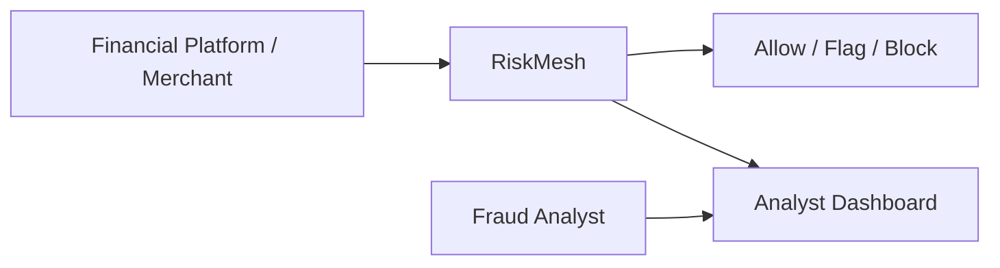
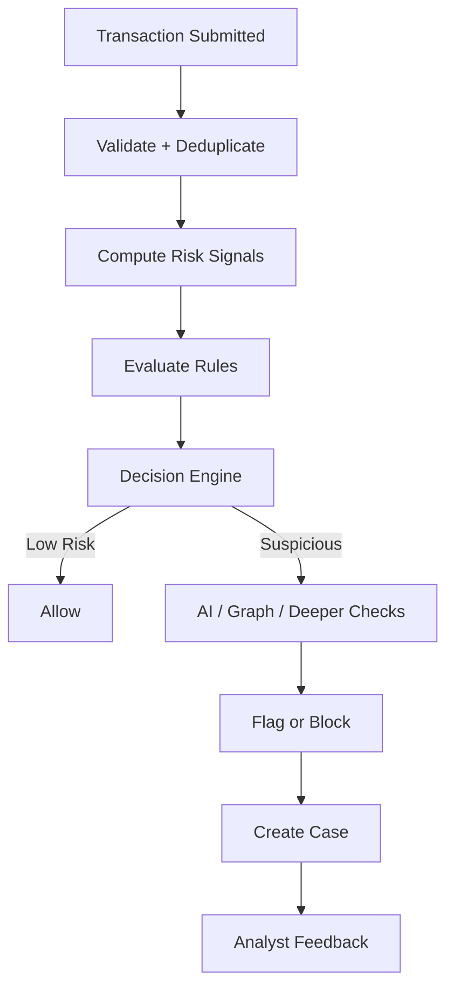
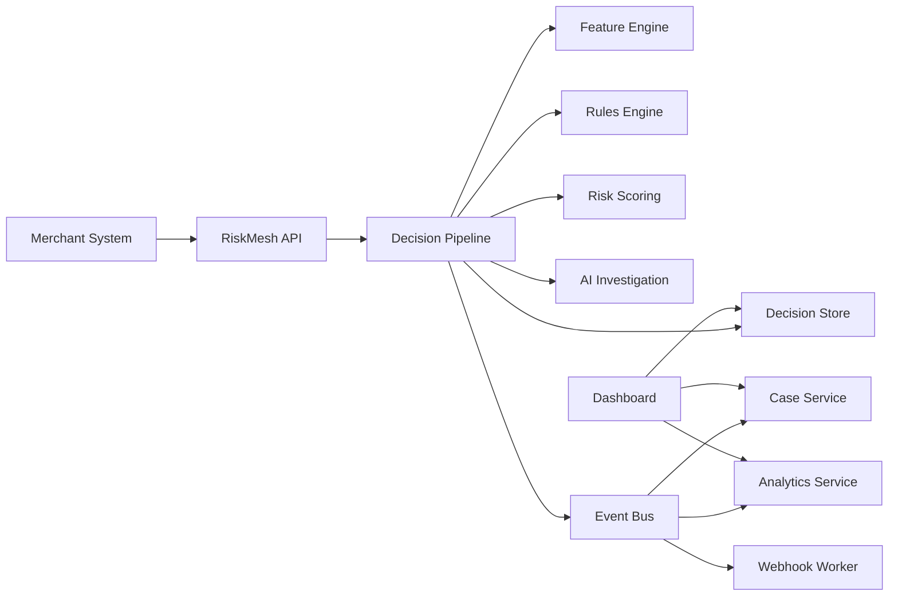
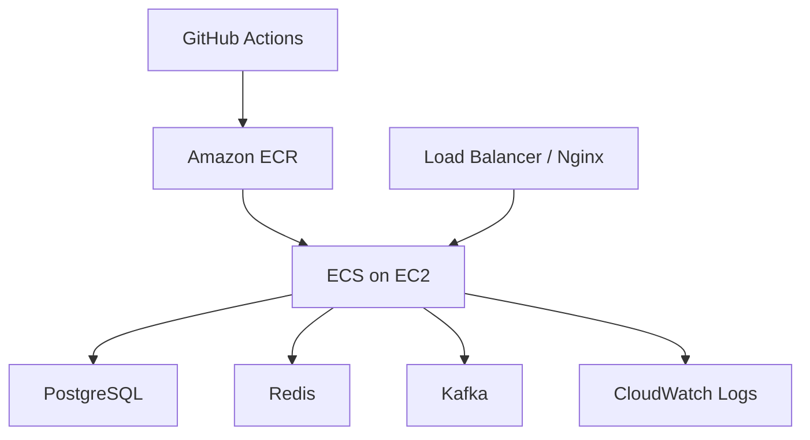

# RiskMesh System Design

## 1. Summary

RiskMesh is a fraud detection backend for financial transactions.

The basic idea is simple: a company sends us a transaction, and RiskMesh decides whether that transaction should be allowed, flagged for review, or blocked before money moves.

RiskMesh should be fast for normal users and stricter for risky activity. If a transaction looks safe, it should go through quickly. If it looks suspicious, RiskMesh should check deeper signals, explain the reason, and create a case for analysts to review.

## 2. What The System Is Trying To Solve

Financial platforms cannot manually check every transaction. They need a system that can make fraud decisions in real time.

The hard part is balance:

- If we are too strict, real users get blocked.
- If we are too loose, fraud gets through.
- If we are too slow, the payment experience becomes bad.
- If we cannot explain the decision, analysts cannot trust the system.

RiskMesh is designed to solve this by combining rules, risk signals, entity relationships, AI investigation, and analyst feedback.

## 3. Design Goals

The system should optimize for:

| Goal | Meaning |
| --- | --- |
| Fast decisions | Low-risk transactions should not make users wait. |
| Explainability | Every flagged or blocked transaction should have clear reasons. |
| Reliability | If AI or background jobs fail, the core fraud decision flow should still work. |
| Feedback | Analyst decisions should improve future rules and risk scoring. |
| Scalability | Parts of the system should be able to scale separately later. |
| Production readiness | The system should be deployable with Docker and AWS ECS on EC2. |

## 4. System Context

RiskMesh sits between a financial platform and the actual money movement.



The company using RiskMesh integrates our API into its transaction flow.

Fraud analysts use the dashboard to review suspicious transactions, resolve cases, and give feedback.

## 5. Core Transaction Flow

In simple words:

1. A merchant sends a transaction to RiskMesh.
2. RiskMesh checks authentication and duplicate requests.
3. RiskMesh turns the transaction into fraud signals.
4. RiskMesh evaluates rules and risk score.
5. If the transaction is low risk, it is allowed quickly.
6. If the transaction is suspicious, deeper checks run.
7. RiskMesh returns `allow`, `flag`, or `block`.
8. Flagged or blocked transactions become analyst cases.
9. Analyst feedback is stored and used to improve the system.



## 6. High-Level Architecture

This is the main shape of the backend.



The system can start with fewer services during v1, but this is the direction we are designing toward.

## 7. Main Components

| Component | What It Does |
| --- | --- |
| RiskMesh API | Accepts transactions, authenticates merchants, handles duplicate requests. |
| Feature Engine | Converts raw transaction data into useful fraud signals. |
| Rules Engine | Runs configurable fraud rules against the transaction. |
| Risk Scoring | Combines signals into a numeric score. |
| AI Investigation | Explains suspicious transactions and compares them with past fraud patterns. |
| Decision Engine | Produces the final `allow`, `flag`, or `block` decision. |
| Case Service | Creates and manages analyst review cases. |
| Analytics Service | Powers dashboard charts and fraud metrics. |
| Dashboard | Lets analysts review cases, inspect evidence, and manage rules. |
| Simulator | Generates normal and fraudulent demo transactions. |

## 8. Decisioning Model

RiskMesh should not treat every transaction the same.

There are two paths:

### Fast Path

Used when the transaction looks normal.

```txt
features -> rules -> risk score -> allow
```

This path should be very fast.

Target:

```txt
under 200 ms
```

### Risk Path

Used when the transaction looks suspicious.

```txt
features -> rules -> risk score -> AI/graph checks -> flag/block -> case
```

This path can do deeper investigation because the transaction already looks risky.

## 9. Example Decision Output

RiskMesh should always return a clear answer.

```json
{
  "transactionId": "txn_123",
  "decision": "flag",
  "riskScore": 87,
  "reasons": [
    "new_device",
    "high_amount_for_user",
    "shared_ip_with_risky_users"
  ],
  "message": "Transaction is suspicious because it came from a new device, has an unusually high amount, and the IP is connected to other risky users."
}
```

The decision should be useful for both machines and humans.

## 10. Data Stores

| Store | Why We Use It |
| --- | --- |
| PostgreSQL | Main durable database for transactions, decisions, rules, cases, and analyst labels. |
| Redis | Fast temporary data like rate limits, idempotency keys, and velocity counters. |
| pgvector | Similarity search for past fraud cases and transaction patterns. |
| Kafka | Event stream between backend services. |
| BullMQ | Background jobs such as webhooks, backtests, and evaluation jobs. |

## 11. Important Events

RiskMesh should record important steps as events.

```txt
transaction.received
features.computed
rules.evaluated
decision.made
case.created
case.resolved
webhook.delivered
eval.completed
```

Events make the system easier to debug, replay, and audit.

## 12. Entity Graph

Fraud is often connected.

A single transaction may look normal, but the device, IP, wallet, or user may be connected to suspicious activity.

RiskMesh should track relationships like:

```txt
user -> device
user -> ip
user -> card
user -> wallet
transaction -> merchant
device -> multiple users
ip -> multiple users
```

This helps detect:

- account takeover
- shared IP abuse
- fraud rings
- fake account networks
- risky devices or wallets

## 13. AI Role

AI should help RiskMesh investigate and explain suspicious activity.

AI should not be the only thing deciding fraud.

Good AI use cases:

- Explain why a transaction is suspicious.
- Compare the transaction with past fraud cases.
- Summarize risk signals for analysts.
- Convert analyst-written rules into structured rule logic.

Bad AI use cases:

- Blocking money movement with no evidence.
- Replacing deterministic rules completely.
- Making decisions that cannot be audited.

If AI fails, RiskMesh should still work using rules and risk scoring.

## 14. Reliability

RiskMesh must handle common failure cases.

| Problem | Design Response |
| --- | --- |
| Merchant retries same request | Use idempotency keys. |
| Too many requests | Use rate limiting. |
| AI service fails | Fall back to rules and deterministic scoring. |
| Webhook fails | Retry with backoff. |
| Background job fails | Retry and store failure state. |
| Service restarts | Recover from database/events. |

## 15. Deployment Model

Local development should use Docker Compose.

Production should use AWS ECS with EC2 launch type.



We are choosing ECS on EC2 because it gives production-style container deployment without the cost and complexity of EKS.

## 16. V1 Scope

The first version should focus on a complete working fraud loop.

V1 should include:

- transaction submit API
- feature calculation
- rules engine
- risk score
- allow / flag / block decision
- case creation
- analyst case resolution
- dashboard basics
- simulator for demo transactions
- feedback stored from analyst decisions

V1 should not try to build everything at once.

## 17. Future Extensions

After the core system works, we can add:

- full multi-agent AI investigation
- custom ML model training
- advanced graph scoring
- rule compiler from natural language
- stronger analytics
- multi-merchant isolation
- better deployment automation
- advanced eval harness

## 18. Open Questions

These are still undecided:

- Should suspicious transactions wait for AI before returning a decision, or should AI run after flagging?
- Should v1 start with card payments, crypto withdrawals, UPI, or generic transactions?
- Should PostgreSQL run on RDS or EC2 in the first deployment?
- Should Kafka be required from day one, or added after the first working version?
- What exact fraud scenarios should the simulator support first?

## 19. Design Direction

RiskMesh should feel like a real fraud platform, not a small ML demo.

The most important loop is:

```txt
transaction -> risk signals -> rules -> decision -> case -> analyst feedback -> better future decisions
```

If we build that loop cleanly, the system will already feel strong. AI, ML, and advanced graph analysis can then make it more powerful without making the first version impossible to finish.
